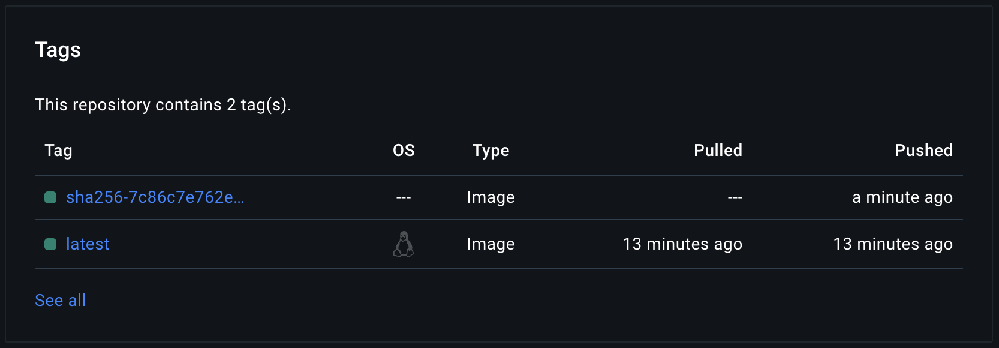

# Documentation of manual flow testing

## Building the docker image

```bash
docker build -t damgem/signed-fortuneteller .
```

Make sure you tag the image in the format of `<dockerhub-username>/<image-name>` or pushing to dockerhub will fail.

## Push the docker image to a registry

Make sure you have a dockerhub account and that you are logged in:

```bash
# docker login     # if you are not yet logged in
docker push damgem/signed-fortuneteller:latest
```

You can check the docker image in uploaded to your dockerhub account: https://hub.docker.com/repository/docker/damgem/signed-fortuneteller

## Signing the docker image

### Install cosign and generate a key pair

```bash
# linux: apt install cosign
# macos: brew install cosign
cosign generate-key-pair
```

Then choose a password.

This will create a cosign.key (the private key) and cosign.pub (the public key) file in the current directory.
You may and probably should commit the public key to the repository.
YOU MUST NOT COMMIT THE PRIVATE KEY TO THE REPOSITORY.

When moving to automating this via the CI pipeline the idea is to add the private key to the CI pipeline as a secret (e.g. GitHub secrets) and then delete it from you system, while keeping the public key in the repository to be able to verify the signature within the CI pipeline / somewhere downstream.


### Sign the docker image

#### Find out the digest of the image

```bash
# Alternative: docker inspect damgem/signed-fortuneteller:latest | grep -i digest -A 1
docker inspect --format='{{index .RepoDigests 0}}' damgem/signed-fortuneteller:latest
```

Example output:
```
damgem/signed-fortuneteller@sha256:7c86c7e762edd96a7c0aa3abfe5c34e2aaa3c4fc3ed73c2b2cdebece8dc95ee6
```

#### Sign the image

```bash
cosign sign --key cosign.key damgem/signed-fortuneteller@sha256:7c86c7e762edd96a7c0aa3abfe5c34e2aaa3c4fc3ed73c2b2cdebece8dc95ee6
```

(You may need to accept the agreement terms of the cosign service)

#### Verify the signature

Now you can see that a new artifact has been created in the registry. For me it is `damgem/signed-fortuneteller:sha256-7c86c7e762edd96a7c0aa3abfe5c34e2aaa3c4fc3ed73c2b2cdebece8dc95ee6.sig`. The `.sig` indicates that this contains the signature of the docker image with the digest `sha256-7c86c7e762edd96a7c0aa3abfe5c34e2aaa3c4fc3ed73c2b2cdebece8dc95ee6`, which is the container that we just built.



You can verify the signature by running:

```bash
cosign verify-blob --key cosign.pub damgem/signed-fortuneteller:latest
```

On success you should see:

```
Verification for index.docker.io/damgem/signed-fortuneteller:latest --
The following checks were performed on each of these signatures:
  - The cosign claims were validated
  - Existence of the claims in the transparency log was verified offline
  - The signatures were verified against the specified public key

...
```

Do let `[{"critical": ...}]` irritate you. The verification was successful if you see the above output.

Instead on failure you should see:

```
Error: no matching signatures: error verifying bundle: comparing public key PEMs, expected ..., got ...
...
```

What this does is:
 - Look at the digest of `damgem/signed-fortuneteller:latest`
 - Find the corresponding signature file `damgem/signed-fortuneteller:<DIGEST>.sig` in the registry
 - Verify the signature against the public key `cosign.pub`

If you're trying to inspect the signature by `docker inspect trust` you will not find anything about any signature, because the signature is not stored in the docker image itself, but as a separate artiface in the registry.
